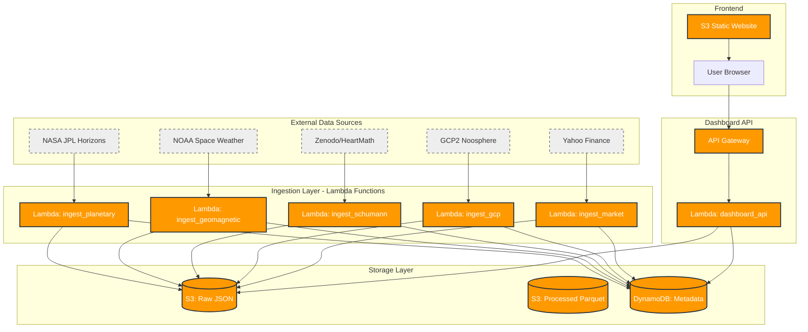

# 🔥 Chimera

**Chimera** is a complexity-based predictive trading system that ingests esoteric environmental datasets (planetary positions, geomagnetic activity, Schumann resonance, global consciousness metrics) and correlates them with financial market movements using AI pattern discovery.

The system is designed to be serverless, cost-effective, and fully automated using AWS Free Tier eligible services with GitOps-driven CI/CD.

## 🚀 Features

- **Multi-Source Data Ingestion**: Collects data from 5 diverse sources including NASA JPL, NOAA, and Yahoo Finance
- **Real-Time Dashboard**: Modern dark-themed monitoring UI with live status and one-click ingestion triggers
- **Fully Serverless**: Event-driven architecture using AWS Lambda, DynamoDB, S3, and API Gateway
- **GitOps CI/CD**: Automated deployments via GitHub Actions with OIDC authentication
- **Cost Optimized**: Uses Provisioned DynamoDB and Lambda Free Tier for minimal cost

## 🏗 Architecture

The system follows a "Serverless Data Pipeline" pattern:



### 1. Ingestion Layer (`src/handlers/`)

| Function | Source | Description |
|----------|--------|-------------|
| `ingest_planetary` | NASA JPL Horizons | Planetary positions (Sun, Moon, planets) |
| `ingest_geomagnetic` | NOAA SWPC | Kp index, solar flux, geomagnetic storms |
| `ingest_schumann` | HeartMath/Zenodo | Earth's electromagnetic resonance |
| `ingest_gcp` | GCP2 Noosphere | Global consciousness RNG correlations |
| `ingest_market` | Yahoo Finance | SPY, QQQ, VIX, Gold, Bitcoin |

### 2. Storage Layer (S3 + DynamoDB)

- **Raw Bucket**: JSON files organized by `source/entity/interval/YYYY-MM-DD.json`
- **Processed Bucket**: Parquet files for analysis (Phase 2)
- **Metadata Table**: Tracks ingestion status with `source_id` + `timestamp` composite key

### 3. Dashboard API (`src/handlers/dashboard_api.py`)

| Endpoint | Method | Description |
|----------|--------|-------------|
| `/status` | GET | Status of all data sources |
| `/health` | GET | System health check |
| `/data/{source}` | GET | Fetch latest data for a source |
| `/ingest/{source}` | POST | Trigger ingestion for a source |

### 4. Frontend (`frontend/`)

- Modern dark-themed dashboard with glassmorphism design
- Real-time status monitoring with auto-refresh
- One-click ingestion triggers
- Activity log

## 📂 Project Structure

```
chimera/
├── src/
│   └── handlers/           # Python Lambda handlers
│       ├── ingest_planetary.py
│       ├── ingest_geomagnetic.py
│       ├── ingest_schumann.py
│       ├── ingest_gcp.py
│       ├── ingest_market.py
│       ├── dashboard_api.py
│       └── requirements.txt
├── frontend/               # Dashboard web UI
│   ├── index.html
│   ├── css/styles.css
│   └── js/app.js
├── phase1-docs/            # Verbose documentation
│   ├── 01_api_research.md
│   ├── 02_architecture_decisions.md
│   └── 03_implementation_log.md
├── .github/
│   └── workflows/
│       └── deploy.yml      # CI/CD pipeline
├── template.yaml           # AWS SAM template
├── samconfig.toml          # SAM deployment config
└── README.md               # This file
```

## 🚀 Deployment (AWS SAM)

This project uses AWS SAM with GitHub Actions CI/CD.

### Prerequisites

- [AWS CLI](https://aws.amazon.com/cli/) configured with `aws configure`
- [AWS SAM CLI](https://docs.aws.amazon.com/serverless-application-model/latest/developerguide/install-sam-cli.html)
- [Python 3.12](https://www.python.org/downloads/)
- GitHub repository with OIDC configured for AWS

### 1. Clone & Configure

```bash
git clone https://github.com/jupiter-hlaj/chimera.git
cd chimera
```

### 2. Deploy via CI/CD

Push to `main` triggers automatic deployment:

```bash
git push origin main
```

Or deploy manually:

```bash
sam build
sam deploy --guided
```

### 3. Upload Dashboard

After deployment, sync the frontend:

```bash
aws s3 sync frontend/ s3://chimera-dashboard-dev-821891894512/ --delete
```

### 4. Access Dashboard

- **Dashboard**: http://chimera-dashboard-dev-821891894512.s3-website-us-east-1.amazonaws.com
- **API**: https://cflufzjv1a.execute-api.us-east-1.amazonaws.com/dev

## 🔗 APIs & Data Sources

| Source | API/Method | Access |
|--------|------------|--------|
| NASA JPL Horizons | `https://ssd.jpl.nasa.gov/api/horizons.api` | Public API |
| NOAA Space Weather | `https://services.swpc.noaa.gov/json/` | Public API |
| HeartMath GCI | Zenodo datasets | Manual download |
| GCP2 Noosphere | `https://gcp2.net/data-results/` | Manual download |
| Yahoo Finance | `yfinance` Python library | Public API |

## 📖 Documentation

Detailed documentation is available in the `phase1-docs/` directory:

- [`01_api_research.md`](phase1-docs/01_api_research.md) - API endpoint research and examples
- [`02_architecture_decisions.md`](phase1-docs/02_architecture_decisions.md) - Design rationale and trade-offs
- [`03_implementation_log.md`](phase1-docs/03_implementation_log.md) - Step-by-step implementation log

## 📜 License

This project is for research and educational purposes.
